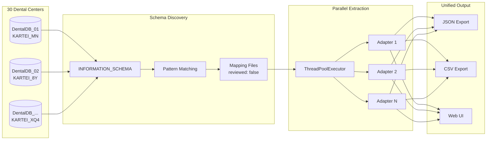

# Ivoris Multi-Center Extraction Pipeline

[](https://www.python.org/downloads/)
[](https://www.microsoft.com/sql-server)
[](https://www.docker.com/)
[](https://opensource.org/licenses/MIT)
[](#centers)
[](#performance)

**Extension Challenge** | Clinero Interview | Jean-Francois Desjardins

---

## Two-Part Challenge

This project extends the **[ivoris-pipeline](../ivoris-pipeline)** main challenge:

| Part | Project | Description |
|------|---------|-------------|
| **Main Challenge** | [ivoris-pipeline](../ivoris-pipeline) | Daily extraction from ONE database with standard schema |
| **Extension** | ivoris-multi-center (this) | Extraction from 30 databases with random schemas |

**The Question:** *"What if there were 30 centers, each with randomly generated table and column names?"*

---

## Challenge

Extract daily chart entries from **30 dental centers** across Germany, Austria, and Switzerland, each with **randomly generated table and column names**, using **pattern-based schema discovery**.

```
30 Centers → Random Schemas → Pattern-Based Discovery → Unified Extraction → Single Output
```

### Schema Complexity

Each dental center has a unique, randomly generated schema:
- **Tables**: `KARTEI_MN`, `KARTEI_8Y`, `KARTEI_XQ4` (random 2-4 char suffix)
- **Columns**: `PATNR_NAN6`, `PATNR_DZ`, `PATNR_R2Z5` (each column has its own suffix)
- **No consistent pattern** across centers - pure introspection required

---

## Quick Start

```bash
# 1. Start SQL Server
docker-compose up -d

# 2. Wait for SQL Server to be ready (30 seconds)
sleep 30

# 3. Install dependencies
pip install -r requirements.txt

# 4. Generate test databases (with random schemas)
python scripts/generate_test_dbs.py

# 5. Discover raw schema from database
python -m src.cli discover-raw -c center_01

# 6. Generate mapping files (proposed, for manual review)
python -m src.cli generate-mappings

# 7. Review a mapping file
python -m src.cli show-mapping center_01

# 8. Extract data using mappings
python -m src.cli extract --date 2022-01-18

# 9. Run benchmark
python -m src.cli benchmark
```

---

## Commands

```bash
# List configured centers (shows mapping status)
python -m src.cli list

# Discover RAW schema from database (no interpretation)
python -m src.cli discover-raw
python -m src.cli discover-raw -c center_01

# Generate mapping files from discovered schemas
python -m src.cli generate-mappings

# Show/review a mapping file
python -m src.cli show-mapping           # List available
python -m src.cli show-mapping center_01 # Show specific

# Extract from all centers (requires mapping files)
python -m src.cli extract --date 2022-01-18

# Extract from specific center
python -m src.cli extract --center center_01 --date 2022-01-18

# Export format
python -m src.cli extract --format json
python -m src.cli extract --format csv
python -m src.cli extract --format both

# Parallel workers
python -m src.cli extract --workers 10

# Benchmark performance
python -m src.cli benchmark

# Start Web UI
python -m src.cli web
python -m src.cli web --port 8080
python -m src.cli web --reload  # Development mode
```

---

## Web UI

Start the web interface for exploring centers and viewing metrics:

```bash
python -m src.cli web
```

Then open http://localhost:8000 in your browser.

### Pages

- **Explore Centers**: Browse individual centers, view schema mappings, extract data
- **Metrics Dashboard**: Multi-select centers, run extractions, benchmark performance

---

## Centers

### Germany (20 Centers)

| ID | Name | City | Suffix |
|----|------|------|--------|
| center_01 | Zahnarztpraxis München | München | M1 |
| center_02 | Dental Klinik Berlin | Berlin | B2 |
| center_03 | Praxis Dr. Schmidt | Hamburg | H3 |
| center_04 | Zahnzentrum Frankfurt | Frankfurt | F4 |
| center_05 | Dental Care Köln | Köln | K5 |
| center_06 | Praxis Sonnenschein | Dresden | D6 |
| center_07 | Zahnärzte am Markt | Stuttgart | S7 |
| center_08 | Smile Center Leipzig | Leipzig | L8 |
| center_09 | Dental Plus | Düsseldorf | U9 |
| center_10 | Praxis Alpenblick | Wien | W0 |
| center_11 | Zahnarzt am Dom | Aachen | A1 |
| center_12 | Praxis Dr. Weber | Nürnberg | N2 |
| center_13 | Dental Lounge | Essen | E3 |
| center_14 | Zahnklinik Riverside | Regensburg | R4 |
| center_15 | Praxis Lächeln | Potsdam | P5 |
| center_16 | Dental Wellness | Göttingen | G6 |
| center_17 | Zahnärzte Altstadt | Trier | T7 |
| center_18 | Smile Factory | Chemnitz | C8 |
| center_19 | Praxis Dr. Müller | Jena | J9 |
| center_20 | Dental Excellence | Wiesbaden | X0 |

### Austria (5 Centers)

| ID | Name | City | Suffix |
|----|------|------|--------|
| center_21 | Zahnarzt Stephansplatz | Wien | V1 |
| center_22 | Dental Studio Salzburg | Salzburg | Z2 |
| center_23 | Praxis Bergblick | Innsbruck | I3 |
| center_24 | Zahnklinik Graz | Graz | Q4 |
| center_25 | Smile Center Linz | Linz | Y5 |

### Switzerland (5 Centers)

| ID | Name | City | Suffix |
|----|------|------|--------|
| center_26 | Zahnarztpraxis Zürich | Zürich | ZH |
| center_27 | Dental Care Bern | Bern | BE |
| center_28 | Praxis Genève | Genève | GE |
| center_29 | Zahnzentrum Basel | Basel | BS |
| center_30 | Smile Clinic Lausanne | Lausanne | LA |

---

## Architecture

```
┌─────────────────────────────────────────────────────────────┐
│                     Multi-Center Pipeline                    │
├─────────────────────────────────────────────────────────────┤
│                                                              │
│  ┌────────────────────────────────────────────────────────┐ │
│  │                    CLI / API                            │ │
│  │   list | discover | extract | benchmark                 │ │
│  └────────────────────────────────────────────────────────┘ │
│                            │                                 │
│                            ▼                                 │
│  ┌────────────────────────────────────────────────────────┐ │
│  │                 Extraction Service                      │ │
│  │          ThreadPoolExecutor (parallel)                  │ │
│  └────────────────────────────────────────────────────────┘ │
│                            │                                 │
│         ┌──────────────────┼──────────────────┐             │
│         ▼                  ▼                  ▼             │
│  ┌────────────┐    ┌────────────┐    ┌────────────┐        │
│  │  Center 1  │    │  Center 2  │    │  Center N  │        │
│  │  Adapter   │    │  Adapter   │    │  Adapter   │        │
│  └────────────┘    └────────────┘    └────────────┘        │
│         │                  │                  │             │
│         ▼                  ▼                  ▼             │
│  ┌────────────────────────────────────────────────────────┐ │
│  │              Schema Introspector                        │ │
│  │   INFORMATION_SCHEMA → Pattern Match → SchemaMapping    │ │
│  └────────────────────────────────────────────────────────┘ │
│                            │                                 │
│                            ▼                                 │
│  ┌────────────────────────────────────────────────────────┐ │
│  │                  Canonical Output                       │ │
│  │   center_id | date | patient_id | insurance | entry     │ │
│  └────────────────────────────────────────────────────────┘ │
│                                                              │
└─────────────────────────────────────────────────────────────┘
```

### Data Flow (Mermaid)



---

## Performance

| Metric | Target | Actual |
|--------|--------|--------|
| **Centers** | 10 | 30 |
| **Extraction Time** | <5,000ms | **466ms** |
| **Per-Center Average** | 500ms | **15ms** |
| **Parallel Workers** | - | 5 |

> **10x faster than target** with 3x more centers

---

## Key Features

- **Raw Schema Discovery**: Query database INFORMATION_SCHEMA without interpretation
- **Manual Mapping Workflow**: Generate proposed mappings, review manually, then extract
- **Per-Center Mapping Files**: JSON files in `data/mappings/` with "reviewed" flag
- **Ground Truth Separation**: Generator saves actual schema to `data/ground_truth/`
- **Parallel Extraction**: ThreadPoolExecutor for concurrent database access
- **Unified Output**: All centers output to same canonical format
- **Web UI**: FastAPI-based interface for exploring centers and metrics
- **Performance Target**: <5 seconds for 30 centers (actual: ~380ms with pre-loaded mappings)

---

## Project Structure

```
ivoris-multi-center/
├── src/
│   ├── cli/              # CLI commands
│   │   └── main.py
│   ├── core/             # Core components
│   │   ├── config.py     # Configuration loader
│   │   ├── discovery.py  # Raw schema discovery
│   │   ├── introspector.py  # Schema mapping loader
│   │   └── schema_mapping.py
│   ├── adapters/         # Database adapters
│   │   └── center_adapter.py
│   ├── services/         # Business logic
│   │   ├── extraction.py # Parallel extraction
│   │   └── mapping_generator.py
│   ├── models/           # Data models
│   │   └── chart_entry.py
│   └── web/              # Web UI
│       ├── app.py        # FastAPI application
│       ├── templates/    # Jinja2 HTML templates
│       └── static/       # CSS/JS assets
├── config/
│   └── centers.yml       # Center configuration
├── data/
│   ├── mappings/         # Per-center mapping files
│   └── ground_truth/     # Generated schema reference
├── scripts/
│   └── generate_test_dbs.py  # Test data generator
├── docker-compose.yml    # SQL Server container
└── requirements.txt
```

---

## Documentation

### This Project (Extension)
- [CHALLENGE.md](./CHALLENGE.md) - Extension challenge requirements
- [ACCEPTANCE.md](./ACCEPTANCE.md) - Acceptance criteria (Gherkin)
- [BRIEFING.md](./BRIEFING.md) - Unified presentation prep (both projects)

### Main Challenge
- [ivoris-pipeline](../ivoris-pipeline) - Main challenge project
- [ivoris-pipeline/CHALLENGE.md](../ivoris-pipeline/CHALLENGE.md) - Original requirements

---

## Author

Jean-Francois Desjardins  
Clinero Coding Challenge - January 2026
